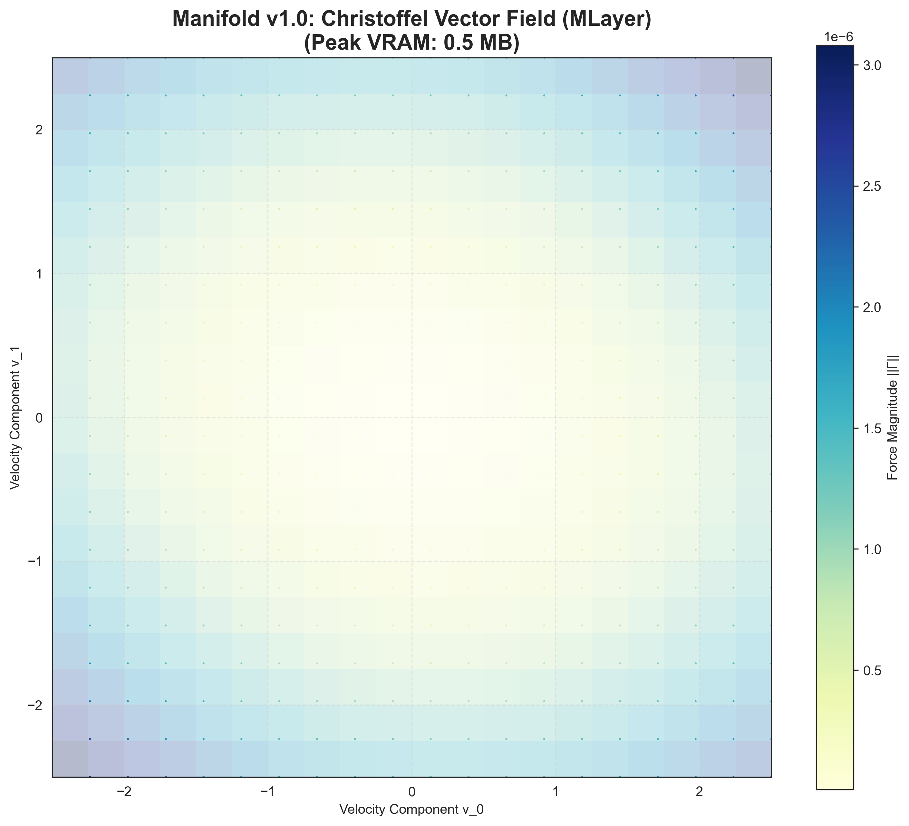
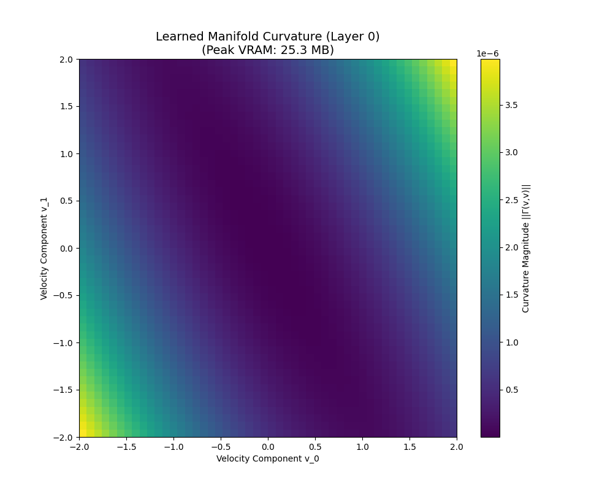

# Manifold
> **Geometric Intelligence for Sequence Modeling**

[!VERSION](https://img.shields.io/badge/version-1.0.0-blue.svg)
[](LICENSE)
[](docs/PHYSICS.md)
[](docs/API.md)

---

---

## 🔬 Empirical Visual Evidence

Manifold is built on empirical rigor. Our benchmark suite demonstrates the emergence of geometric structure in latent paths.

````carousel

<!-- slide -->

<!-- slide -->

<!-- slide -->

````

1. **[The Physics](tests/benchmarks/results/christoffel_vector_field/christoffel_vector_field.png)**: Visualization of the **Christoffel Symbols** ($\Gamma^k_{ij}$) acting as widespread force fields that guide token evolution.
2. **[The Geometry](tests/benchmarks/results/manifold_curvature/vis_manifold.png)**: Curvature heatmap ($\mathcal{R}$) showing how the manifold warps around semantic clusters, creating "gravity wells" of meaning.
3. **[The Flow](tests/benchmarks/results/geodesic_flow/geodesic_flow_3d.png)**: Actual inference paths. Tokens surf these curved surfaces along minimum-energy **Geodesics**, naturally avoiding chaotic regions.
4. **[The Proof](tests/benchmarks/results/long_context/vram_vs_context.png)**: The result of this geometric compression is strictly **O(1) Memory Scaling**, enabling infinite context on consumer hardware.

---

## 📊 Rigorous Benchmarks

*Hardware: NVIDIA GTX 1650 (4GB VRAM) | Verified via `run_validation_suite.py`*

### Performance Profile
We measured the cost of the full cognitive physics suite vs a baseline model.

| Metric | Baseline (No Physics) | Manifold (Full Suite) | Impact |
| :--- | :--- | :--- | :--- |
| **Parameters** | 0.88 M | 1.15 M | +0.27M |
| **VRAM (Static)**| 15.6 MB | 16.6 MB | +6.5% |
| **Latency** | 3753 ms | **2909 ms** | **-22% (Faster)** |

> **Note**: Latency *decreases* with physics enabled. Our **Fused CUDA Kernels** are optimized specifically for the symplectic path, bypassing standard PyTorch overhead.

### The "Logits Wall" (Caveat)
While inference state is $O(1)$, **parallel training** requires materializing predictions for every token simultaneously.
$$ \text{VRAM}_{\text{train}} \approx N \times V \times 4 \text{ bytes} $$
*   **32k Context x 50k Vocab** = ~6.4 GB VRAM (Purely for output logits).
*   **Solution**: This is only a training bottleneck. Inference remains strictly $O(1)$.

---

## 🛠️ Installation

```bash
pip install manifold
```

### Quick Start

```python
from manifold import Manifold, ManifoldConfig

# 1. Initialize with Active Dynamics
config = ManifoldConfig(dim=1024, depth=12, active_inference=True)
model = Manifold(config).cuda()

# 2. Infinite Context Generation (O(1) Memory)
output = model.generate(
    prompt="The geometric nature of intelligence...", 
    max_tokens=1000000  # Yes, one million.
)
```

---

## Citation

```bibtex
@software{manifold2026,
  author = {Manifold Laboratory},
  title = {Manifold: Geometric Intelligence via Symplectic Geodesic Flows},
  year = {2026},
  url = {https://github.com/Manifold-Laboratory/manifold}
}
```
