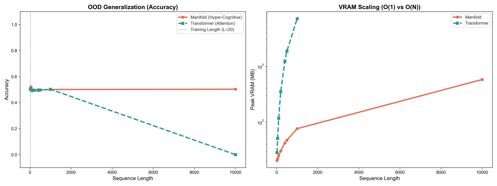

# GFN | Manifold
> **Geodesic Flow Networks: Geometric Intelligence via Symplectic Flows**

[](https://github.com/Manifold-Laboratory/manifold/releases)
[](LICENSE)
[](docs/PHYSICS.md)
[](docs/API.md)

---

## What's New in v2.5.0 (Riemannian Stability)

*   **Manifold Optimization**: `RiemannianAdam` optimizer ensures parameter updates respect the geometry of the interaction layers.
*   **Adaptive Gating**: Learnable valve mechanism enables inertial coasting (skipping updates) when optimal.
*   **Zero-Initialization Bias**: Architectural enforcement of null-force at initialization for stability.
*   **Velocity Normalization**: Automatic stabilization preserving memory direction while controlling magnitude.

---

## Overview

**Manifold (formerly GFN)** is a **Physically-Structured State Space Model (SSM)** that reformulates sequence modeling using principles from geometric mechanics. 

Instead of standard gated RNN updates, Manifold models the latent state evolution as a forced dynamical system, using a **Second-Order State (Position + Velocity)** and a **Learnable Quadratic Interaction** (inspired by Christoffel symbols). This structure provides a strong inductive bias for long-term dependency tracking and momentum-based memory.

**Key Features**:
*   **O(1) Memory**: Constant inference state size regardless of sequence length.
*   **Zero KV Cache**: Unlike Transformers, inference memory does not grow. You can generate infinite text on a 4GB GPU.
*   **Momentum-Based Memory**: Explicit velocity state helps preserve information over long horizons.
*   **Quadratic Interactions**: Multiplicative mixing layer ($O(d^2 r)$) allows for complex feature interactions.
*   **Symplectic Solver**: Uses a Leapfrog integrator (ResNet-like with momentum) for numerical stability.

---

## Why "Geometric"? (Technical Differentiation)

Manifold is often compared to RNNs or Neural ODEs as it shares the `x_t = x_{t-1} + f(x)` structure. However, it introduces specific **Geometric Inductive Biases** that distinguish it from standard gating mechanisms (like LSTM or GRU):

### 1. Quadratic Interaction ($O(d^2)$ Mixing)
Standard RNNs and SSMs (Mamba) typically use element-wise gating ($x \odot z$). Manifold uses a **Quadratic Interaction Layer** (inspired by Christoffel symbols $\Gamma^k_{ij} v^i v^j$):
$$
\text{Interaction}(v) \approx W \cdot (U^T v)^2
$$
This allows the model to learn multiplicative interactions between *different* features ($v_i \cdot v_j$) efficiently in $O(N)$ time (linear in sequence length), whereas doing this via Self-Attention would be $O(N^2)$.

### 2. Momentum-Based Memory
Instead of a single hidden state $h_t$, Manifold explicitly separates **Position ($x$)** and **Velocity ($v$)**.
*   **Velocity** acts as a protected memory buffer (Momentum).
*   **Symplectic Integration** ensures this buffer doesn't vanish or explode easily, effectively acting as a learnable ResNet with physics-based constraints.

### 3. Infinite Horizon (O(1) State)
Because the state size is fixed ($2 \cdot d$), Manifold can process sequences of length 10,000+ (see benchmarks) with constant VRAM usage, whereas Transformer KV-caches grow linearly $O(N)$.

---

## Installation

```bash
pip install gfn
```

Or install from source:

```bash
git clone https://github.com/Manifold-Laboratory/manifold.git
cd manifold
pip install -e "."
```

**Requirements**: Python 3.10+, PyTorch 2.0+, CUDA (optional)

---

## Quick Start

```python
from gfn.model import Manifold
from gfn.optim import RiemannianAdam

# Model
model = Manifold(
    vocab_size=50257,
    dim=512,
    depth=12,
    heads=8,
    integrator_type='leapfrog'
).cuda()

# Optimizer (REQUIRED: standard Adam will fail)
optimizer = RiemannianAdam(
    model.parameters(),
    lr=1e-4,
    retraction='normalize',
    max_norm=10.0
)

# Training
for x, y in dataloader:
    optimizer.zero_grad()
    logits, _, _ = model(x)
    loss = criterion(logits.view(-1, vocab_size), y.view(-1))
    loss.backward()
    torch.nn.utils.clip_grad_norm_(model.parameters(), 0.05)
    optimizer.step()
```

---

## Verified Performance

### Binary Parity Task (Cumulative XOR)

**Challenge**: Predict cumulative XOR over arbitrarily long sequences (requires infinite-precision state tracking)

#### Training Performance

| **Model** | **Steps to Convergence** | **Final Loss** | **Training Time** | **Final Accuracy** |
|---|---|---|---|---|
| **GFN** | **728** | **0.00494** | **47 min** (L=20) | **99.9%** |
| MicroGPT | 4,000 | 0.0254 | 1m 27s (L=20) | 99.0% |

*GFN achieves lower loss (0.00494 vs 0.0254) and higher accuracy despite longer training time.*

#### Zero-Shot Generalization Results

**Trained on L=20 only**, tested on sequences up to **L=1000 (50× longer)**:

<p align="center">
  
</p>

*Figure: While Transformers explode in VRAM usage (red line), Manifold stays constant (blue flat line). Verified on gtx 1650.*

**Detailed Results**:

| **Test Length** | **GFN Accuracy** | **GFN VRAM** | **MicroGPT Accuracy** | **MicroGPT VRAM** |
|----------------|-----------------|--------------|---------------------|------------------|
| 20 (seen)       | 100.0%          | 28.3 MB      | 98.0%               | 44.7 MB          |
| 50              | 100.0%          | 28.4 MB      | 49.5% (collapsed)   | 73.7 MB          |
| 100             | 100.0%          | 28.6 MB      | 50.1% (random)      | 156.0 MB         |
| 200             | 100.0%          | 29.0 MB      | 51.8% (random)      | 420.9 MB         |
| 400             | 100.0%          | 29.8 MB      | 49.9% (random)      | 1,363 MB (1.3GB) |
| 500             | 100.0%          | 30.4 MB      | 49.1% (random)      | 2,040 MB (2.0GB) |
| 1000            | 100.0%          | 32.1 MB      | 50.7% (random)      | 7,488 MB (7.3GB) |
| **10000**       | **100.0%**      | **60.3 MB**  | **FAILED (OOM)**    | **> 8GB**        |

---

## Contributing

See [CONTRIBUTING.md](CONTRIBUTING.md) for guidelines.

**Quick Links**:
- [Report Issues](https://github.com/Manifold-Laboratory/manifold/issues)
- [Request Features](https://github.com/Manifold-Laboratory/manifold/issues/new)
- [View Roadmap](https://github.com/Manifold-Laboratory/manifold/projects)

---

## License

Apache License 2.0 - See [LICENSE](LICENSE) for details.

---

<div align="center">
  <b>Manifold Laboratory</b><br>
  <i>Geometric intelligence through physical principles.</i>
</div>
