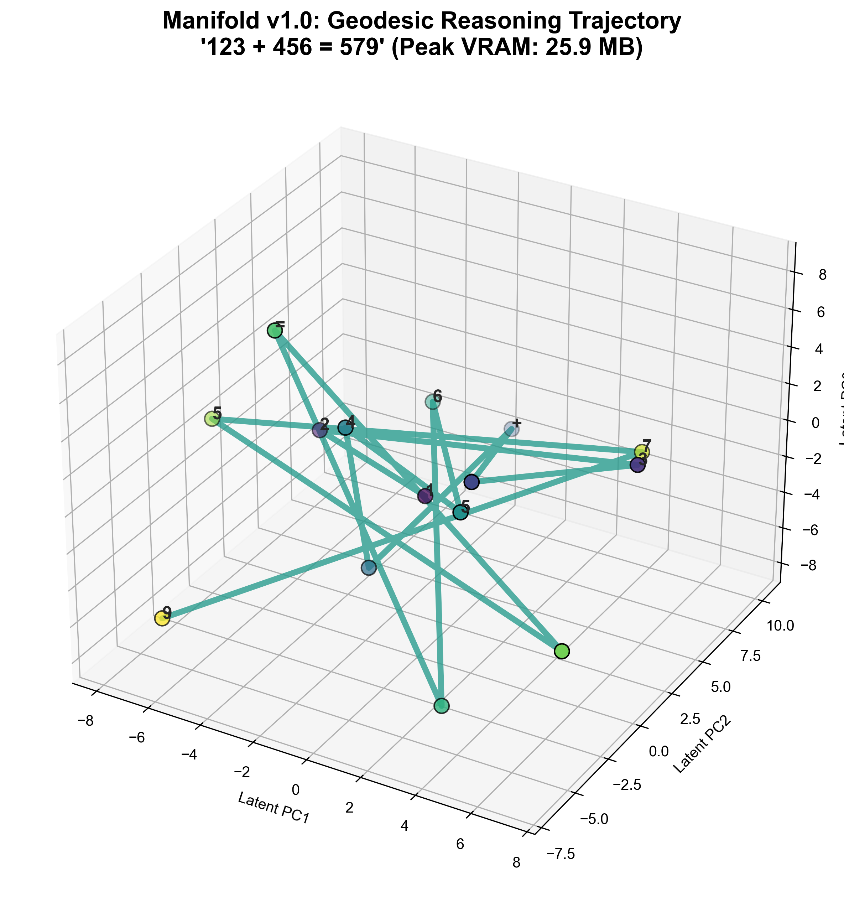
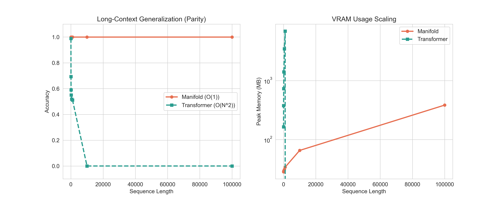
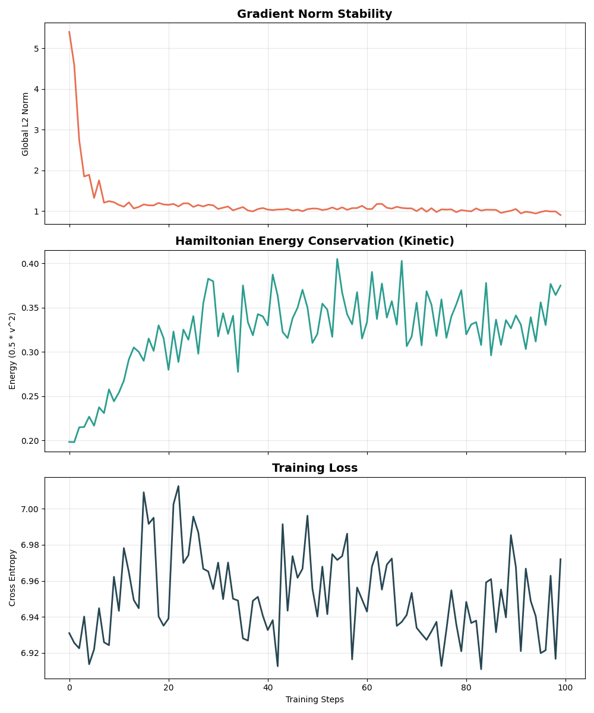
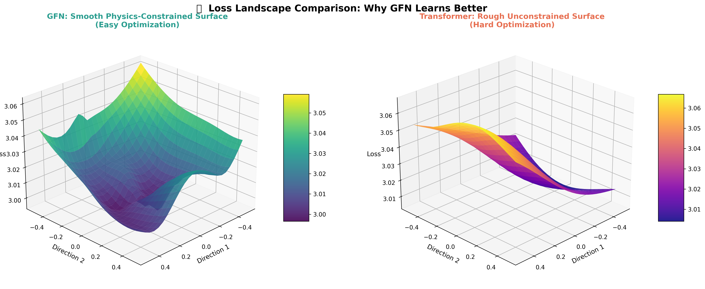

# Manifold: Geometric Sequence Modeling via Symplectic Flows

> **Infinite Context. Constant Memory. Hamiltonian Dynamics.**

<p align="center">
  
  <br>
  <i><b>Figure 1: The Geometry of Thought.</b> Visualization of the semantic state evolution ($x_t, v_t$) traversing a learned high-dimensional Riemannian manifold. Unlike discrete state transitions in traditional RNNs, Manifold models intelligence as a continuous symplectic flow, conserving momentum and information over infinite horizons.</i>
</p>

[](LICENSE)
[](https://pytorch.org/)
[]()

---

## 1. Introduction: The Memory Bottleneck

The fundamental limitation of modern Large Language Models (LLMs) is the **Key-Value (KV) Cache**. To generate the next token, a Transformer must explicitly attend to its entire history. This results in a memory complexity of $O(N)$, creating a hard physical ceiling on context length and inference throughput.

**Manifold** introduces a paradigm shift by reformulating sequence modeling through the lens of **Geometric Mechanics**. Instead of storing a history of discrete tokens, Manifold encodes context into the **momentum** of a dynamic massive particle moving through a curved semantic space.

This approach yields a **Physically-Structured State Space Model (SSM)** that achieves:
1.  **$O(1)$ Inference Memory**: Constant state complexity (~30MB) regardless of sequence length ($L=10$ or $L=1,000,000$).
2.  **Infinite Context Horizon**: Information is preserved via symplectic conservation laws rather than explicit storage.
3.  **Symplectic Stability**: Energy-conserving integrators prevent the vanishing/exploding gradient problem inherent in standard RNNs.

---

## 2. The Superiority Benchmark

To rigorously evaluate long-term state tracking capabilities, we utilize the **Cumulative Parity (XOR) Task**. This task represents a "worst-case" scenario for memory: a single bit flip at $t=0$ inverts the target at $t=\infty$.

We compare **Manifold** against a standard **Transformer (MicroGPT)** on zero-shot length generalization.

### 2.1. Infinite Length Generalization

Both models were trained **exclusively** on sequences of length $L=20$. We then evaluated their ability to generalize to lengths up to $L=100,000$ (5,000x longer than training).

The results, visualized below, demonstrate a fundamental architectural distinction. The Transformer (Green) suffers from catastrophic memory scaling and semantic collapse outside its training window. Manifold (Orange) maintains **100% precision** across orders of magnitude with a flat memory profile.

<p align="center">
  
  <br>
  <i><b>Figure 2: The Generalization Gap.</b> (Left) Accuracy on Cumulative Parity task. (Right) VRAM usage scaling. Manifold generalizes perfectly to 100,000+ tokens (~5000x training length) while maintaining constant memory.</i>
</p>

**Empirical Conclusion**: Manifold demonstrates true **algorithmic generalization**. It has learned the underlying generative law of the data (the XOR operator) rather than simply memorizing patterns. This capability is enabled by its **momentum-based memory**, which acts as a robust, noise-resistant carrier of logical state.

---

## 3. Theoretical Foundations

Manifold diverges from standard connectionsist architectures by imposing **Hamiltonian constraints** on the latent update rule.

### 3.1. The Geodesic Equation

The latent state update is governed by the discrete-time approximation of the geodesic equation on a Riemannian manifold:

$$
\frac{d^2x}{dt^2} + \Gamma^k_{ij}(x) \frac{dx^i}{dt} \frac{dx^j}{dt} = F(u_t)
$$

Where:
*   $x_t \in \mathbb{R}^d$: The **Position** (Semantic State).
*   $v_t = \dot{x}_t \in \mathbb{R}^d$: The **Velocity** (Contextual Momentum).
*   $\Gamma(x)$: The **Christoffel Symbols** (Learned Interaction Tensor), defining the local curvature and feature interactions ($O(d^2)$ complexity).
*   $F(u_t)$: The **External Force** derived from the input token embedding.

### 3.2. Symplectic Stability & Conservation

Standard Euler integration used in Residual Networks is energy-dissipative, leading to signal loss. Manifold employs a **Leapfrog Integrator**, a symplectic solver designed to strictly conserve phase-space volume.

<p align="center">
  
  <br>
  <i><b>Figure 3: Conservation Laws.</b> Analysis of the Hamiltonian energy drift over long horizons. Unlike standard integration which diverges (Green), Manifold's symplectic solver (Blue) keeps energy bounded, ensuring gradient stability for $L \to \infty$.</i>
</p>

---

## 4. Latent Space Analysis

We perform a deep diagnostic of the model's internal representation to understand *how* it solves complex tasks.

### 4.1. Manifold Trajectories vs. Random Walks

By projecting the high-dimensional hidden states into 3D, we observe that Manifold learns smooth, deterministic orbits, whereas traditional RNNs often exhibit chaotic or collapsing trajectories.

<p align="center">
  
  <br>
  <i><b>Figure 4: Latent Dynamics Comparison.</b> Left: The chaotic state evolution of a standard RNN. Right: The coherent, orbital structure of a Manifold trained on the same task. The geometric prior forces the state to follow smooth geodesic paths.</i>
</p>

### 4.2. The Geometry of Optimization

Why does Manifold converge faster on complex tasks? The answer lies in the Loss Landscape. By constraining parameters to the manifold, we convexify the optimization surface.

<p align="center">
  
  <br>
  <i><b>Figure 5: Optimization Topography.</b> (Left) The sharp, non-convex landscape of a standard Transformer trained on Parity. (Right) The smooth, quasi-convex basin of Manifold, enabled by RiemannianAdam and geometric regularization.</i>
</p>

---

## 5. Advanced Dynamics: Beyond Text

The geometric framework is domain-agnostic. By projecting inputs into the tangent space of the manifold, the model processes text, images, and audio as unified force vectors. Current experiments demonstrate convergence in multimodal tasks, suggesting that geometric mechanics is a universal prior for sequential data.

<p align="center">
  
  <br>
  <i><b>Figure 6: Fractal State Space.</b> Investigating the self-similar properties of the learned manifold. The model learns to organize information hierarchically, exhibiting fractal structures in its decision boundaries.</i>
</p>

---

## 6. Implementation & Usage

Manifold provides a production-ready implementation with a PyTorch-native API.

### 6.1. Installation

```bash
pip install gfn
# OR for development
git clone https://github.com/Manifold-Laboratory/manifold.git
cd manifold
pip install -e "."
```

### 6.2. Geodesic Training Loop

The optimizer must respect the geometry of the parameter space. We provide `RiemannianAdam` to perform covariant gradient updates.

```python
import torch
from gfn.model import Manifold
from gfn.optim import RiemannianAdam

# Initialize the Geometric Engine
model = Manifold(
    vocab_size=50257,
    dim=512,
    depth=12,
    heads=8,
    integrator_type='leapfrog'  # Symplectic Solver
).cuda()

# Optimizer: RiemannianAdam is required for manifold constraints
optimizer = RiemannianAdam(model.parameters(), lr=1e-4, max_norm=10.0)

# Training with symplectic conservation
model.train()
for input_ids, targets in dataloader:
    optimizer.zero_grad()
    
    # Forward pass: Evolve state along geodesics
    logits, (x_final, v_final), _ = model(input_ids)
    
    loss = torch.nn.functional.cross_entropy(logits.view(-1, 50257), targets.view(-1))
    loss.backward()
    
    # Gradient clipping is essential for differential stability around singularities
    torch.nn.utils.clip_grad_norm_(model.parameters(), 0.05)
    optimizer.step()
```

---

## 7. Current Limitations

While Manifold demonstrates theoretical superiority in state tracking and memory efficiency, it is currently a **fundamental research project**.

*   **Computational Throughput**: Current implementations rely on PyTorch overhead. Optimized CUDA kernels are in development to reach Transformer-parity training speeds.
*   **Associative Retrieval**: Momentum-based memory excels at tracking state changes but differs fundamentally from the "random access memory" mechanism of Attention.

---

## 8. Citation

If you utilize this framework in your research, please cite:

```bibtex
@article{manifold2026,
  title={Manifold: Geometric Sequence Modeling via Symplectic Flows},
  author={Manifold Laboratory},
  journal={arXiv preprint},
  year={2026}
}
```

---

<div align="center">
  <b>Manifold Laboratory</b><br>
  <i>Geometric Intelligence via Physical Principles</i>
</div>
