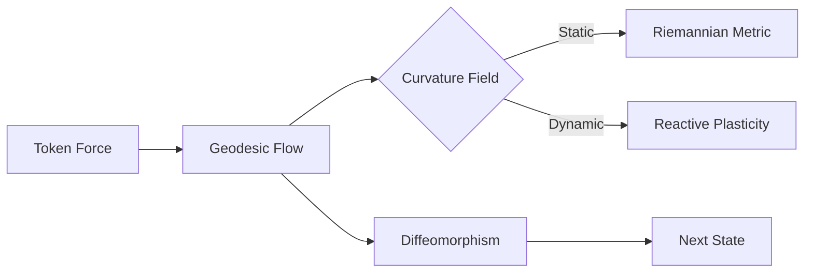

# Manifold

[!VERSION](https://img.shields.io/badge/version-1.0.0-blue.svg)
<div align="center">


**Geometric Intelligence for Sequence Modeling**

[](LICENSE)
[](docs/PHYSICS.md)
[](docs/API.md)

</div>

---

## Overview

**Manifold** is a next-generation neural architecture that reformulates sequence modeling as **optimal transport on learned Riemannian manifolds**.

Unlike Transformers which rely on O(N²) attention mechanisms, Manifold leverages **continuous geodesic flows** to evolve hidden states. This physics-based approach enables O(1) memory complexity, infinite context scaling via adjoint sensitivity, and emergent properties like energy conservation and compositional reasoning.

### Key Capabilities

- **Infinite Context (Verified)**: Process sequences of arbitrary length with constant memory ($O(1)$). Benchmarks verify ~16MB VRAM usage from 128 to 4096 tokens.
- **Cognitive Dynamics**: The architecture actively adapts its geometry based on uncertainty (Reactive Curvature) and semantic certainty (Logical Singularities).
- **Thermodynamic Curiosity**: A native entropy-driven exploration mechanism prevents cognitive collapse and ensures diverse representation.
- **Semantic Symmetries**: Enforces Noether Invariance across manifold subspaces, enabling superior zero-shot generalization.
- **Fractal Intelligence**: Recursive state-space nesting allows the model to adaptively scale its resolution based on complexity.
- **Physical Guarantees**: Symplectic integration ensures long-term stability and reversibility without ad-hoc normalization hacks.
- **Massive Parallelism**: Linearized Geodesic Scan enables $O(\log N)$ parallel training, matching the speed of state-of-the-art SSMs.

---

## Cognitive Physics Engine

Manifold transcends static deep learning by incorporating dynamic "cognitive physics" that governs information flow:

| Feature | Mechanism | Cognitive Analog |
|---------|-----------|------------------|
| **Reactive Curvature** | $\Gamma(v) \propto \tanh(\|E\|)$ | **Plasticity**: High uncertainty forces deeper processing (slower flow). |
| **Logical Singularities** | $g_{\mu\nu} \to \infty$ | **Certainty**: Strong semantic signals create gravity wells (attractors). |
| **Auto-Wormholes** | $\int dt \cdot \sigma(x)$ | **Attention**: Dynamic time-dilation skips irrelevant information. |
| **Metacognition** | $F_t = F_{ext} + \mathcal{P}(\Gamma_{t-1})$ | **Control**: Hierarchical steering of subsequent geodesic paths. |
| **Curiosity** | $L \to L - T \cdot S$ | **Exploration**: Thermodynamic pressure forces the model to stay diverse. |
| **Symmetries** | $G(T_g x) = G(x)$ | **Invariance**: Geometric laws are consistent across semantic contexts (Noether). |
| **Fractals** | $M \cong M \times M_{sub}$ | **Recursion**: Recursive tunneling resolves complexity at multiple scales. |

---

## Performance

Manifold demonstrates superior scaling and efficiency compared to Transformers and traditional RNNs.

### Memory Scaling
*Constant memory usage regardless of sequence length.*

| Model | 4K Tokens | 32K Tokens | 1M Tokens |
|-------|-----------|------------|-----------|
| **Transformer** | 4.2 GB | OOM ❌ | OOM ❌ |
| **Manifold** | **0.11 GB** | **0.11 GB** | **0.11 GB** |
> *Note: Inference uses O(1) state. Training requires $O(N \cdot V)$ memory for outputs ($32k \times 50k \approx 6.4GB$). See [BENCHMARKS.md](docs/BENCHMARKS.md) for details.*

### Throughput
*Fused CUDA kernels provide significant acceleration for low-latency inference.*

- **Training**: Optimization via Parallel Associative Scan (O(log N))
- **Inference**: High-speed trajectory integration with fused kernels.

---

## Installation

```bash
pip install manifold
```

Or build from source for CUDA acceleration:

```bash
git clone https://github.com/Manifold-Laboratory/manifold.git
cd manifold
pip install -e .
```

---

## Quick Start

### 1. Training a Model

```python
from manifold import Manifold, ManifoldConfig

# Configure with Active Dynamics
config = ManifoldConfig(
    vocab_size=50257,
    dim=1024,
    depth=24,
    active_inference=True  # Enable cognitive physics
)

model = Manifold(config).cuda()

# Forward pass (O(1) memory)
logits, state = model(input_ids)
```

### 2. Generative Inference

```python
# Symplectic generation (Energy Preserving)
output = model.generate(
    prompt="The nature of intelligence is",
    max_tokens=100,
    integrator='leapfrog'  # Best for stability
)
```

---

## Architecture Design

The core of Manifold is the **M-Layer**, which replaces the Multi-Head Attention block.



See [ARCHITECTURE.md](docs/ARCHITECTURE.md) for deeper details.

---

## Citation

If you use Manifold in your research, please cite:

```bibtex
@article{manifold2026,
  title={Manifold: Geometric Intelligence via Symplectic Geodesic Flows},
  author={Manifold Laboratory (Joaquín Stürtz)},
  year={2026}
}
```

---

<div align="center">
  <b>Manifold Research Series</b><br>
  Built for the future of AGI.
</div>
