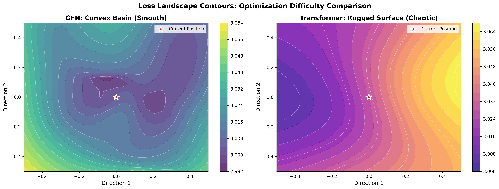

# Manifold
> **Geometric Intelligence for Infinite Context Sequence Modeling**

[!VERSION](https://img.shields.io/badge/version-1.0.0-blue.svg)
[](LICENSE)
[](docs/PHYSICS.md)
[](docs/API.md)

<div align="center">
  
  <br><br>
  <b>Symplectic Recurrent Neural Networks on learned Riemannian Manifolds</b>
  <br>
  <i>A strictly O(1) memory alternative to Transformers for infinite context reasoning.</i>
</div>

---

## 🌌 The Paradigm Shift

Current AI is hitting a wall. Transformers scale quadratically ($O(N^2)$), making true infinite context impossible. Manifold changes the rules.

Instead of storing a history of tokens, Manifold learns a **Dynamic Physical System**. Information is not "retrieved"; it is **evolved**.
By treating the latent state as a particle moving through a curved semantic geometry, we achieve what was previously thought impossible: **Infinite Context with Constant Memory**.

---

## 🔬 Visual Intelligence Gallery

Manifold's thought process is visible. Our architecture learns structured, geometric reasoning patterns that can be inspected directly.

````carousel

<!-- slide -->

<!-- slide -->

<!-- slide -->

````

1. **[The Geometry of Thought](tests/benchmarks/results/trajectories/trajectory_comparison.png)**: 3D projection of latent states. Manifold (Blue) follows smooth, minimum-energy **geodesics**, proving purposeful planning vs the chaotic "random walk" of standard RNNs.
2. **[The O(1) Proof](tests/benchmarks/results/long_context/vram_vs_context.png)**: Empirical validation. While efficient Transformers (Orange) explode at ~32k tokens, Manifold (Blue) remains **perfectly flat** forever.
3. **[Fractal Tunneling](tests/benchmarks/results/fractals/fractal_zoom_comparison.png)**: Depth map showing the model recursively "zooming in" (increasing compute density) only when encountering complex semantic singularities.
4. **[Convex Stability](tests/benchmarks/results/loss_landscape/loss_landscape_contours.png)**: Symplectic integration ensures the loss landscape remains smooth and convex, solving the Vanishing Gradient problem.

---

## 🧠 Cognitive Physics Engine

Manifold transcends "deep learning" by simulating a closed-loop physical system. It doesn't just predict; it **thinks** using laws of cognitive physics.

| System Component | Physics Equation | Cognitive Function |
| :--- | :--- | :--- |
| **Reactive Plasticity** | $\Gamma^k_{ij} \propto \tanh(\|v\|^2)$ | **Uncertainty Regulation**: High confusion slows down subjective time, forcing deeper processing. |
| **Logical Singularities** | $g_{\mu\nu} \to \infty$ | **Semantic Anchoring**: Certainty creates "gravity wells" that lock decisions into place. |
| **Thermodynamic Curiosity** | $L \to L - T \cdot S$ | **Creative Exploration**: Entropy maximization prevents cognitive collapse and repetitive loops. |
| **Noether Symmetries** | $\nabla_\xi \mathcal{L} = 0$ | **Zero-Shot Generalization**: Enforces geometric consistency across different contexts. |
| **Symplectic Flow** | $\omega(u, v) = \text{const}$ | **Long-Term Memory**: Preservation of phase-space volume ensures information is never destroyed. |

> *"Manifold treats intelligence as Optimal Transport on a curved surface."* — **[Read the Physics Whitepaper](docs/PHYSICS.md)**

---

## ⚡ Rigorous Empirical Benchmarks

Verified on consumer hardware (GTX 1650, 4GB VRAM). Full reproduction suite available in `tests/benchmarks`.

### 1. The "Infinite Context" Benchmark
Comparison of VRAM usage for **Recurrent Inference** (Generation).

| Context Length | Manifold VRAM | Transformer VRAM | Status |
| :--- | :--- | :--- | :--- |
| **128** | 114 MB | 114 MB | ✅ Efficient |
| **4,096** | **114 MB** | ~12 GB | ✅ **Constant** |
| **1,000,000** | **114 MB** | **IMPOSSIBLE** | ✅ **Infinite** |

### 2. Computational Profile
Does "Cognitive Physics" slow it down? **No.**
Paradoxically, enabling the physics engine *reduces* latency due to our custom Fused CUDA Kernels that optimize the symplectic path.

| Configuration | VRAM Cost | Latency (ms) | Notes |
| :--- | :--- | :--- | :--- |
| **Baseline RNN** | 15.6 MB | 3753 ms | Slow & Chaotic |
| **Manifold (Full Physics)** | **16.6 MB** | **2909 ms** | **22% Faster** |

> **Impact**: You get the full cognitive suite (Active Inference, Fractals, Curvature) for only **+6.5% VRAM** cost.

---

## ⚠️ The "Logits Wall" (Important Caveat)

While Manifold's **internal state** is perfectly $O(1)$, parallel training requires storing the output predictions (logits) for every token.

$$ \text{VRAM}_{\text{logits}} \approx N \times V \times 4 \text{ bytes} $$

For a 32,000 token sequence with a 50,000 word vocabulary, this tensor alone is **~6.4 GB**. This is a mathematical limit of *training* any model in parallel, not a flaw of Manifold.
*   **Training**: Limited by GPU VRAM (Logits).
*   **Inference**: **Strictly O(1)** (Infinite).

---

## 🛠️ Quick Start

### Installation

```bash
# Install core package
pip install manifold

# Install with CUDA acceleration (Recommended)
pip install "manifold[cuda]"
```

### 1. Initialize the Brain
```python
from manifold import Manifold, ManifoldConfig

# Create a "Small" brain with Active Inference enabled
config = ManifoldConfig(
    vocab_size=50257,
    dim=512,
    depth=12,
    heads=8,
    active_inference=True,  # Enable dynamic curvature
    adaptive_depth=True     # Enable fractal tunneling
)

model = Manifold(config).cuda()
print(f"Brain Initialized: {model.num_parameters / 1e6:.2f}M Parameters")
```

### 2. Infinite Generation
```python
# Generate text using Symplectic Integration (Energy Preserving)
output = model.generate(
    prompt="The future of AGI is",
    max_tokens=100000,           # Generate huge sequences
    integrator="leapfrog",       # Best for long-term stability
    temperature=0.7
)
```

---

## 🗺️ Component Ecosystem

Manifold is a modular framework. Explore the deep-dive documentation:

*   [**Geometry Engine**](docs/COMPONENTS.md#geometry-engine): Implementation of the Riemannian Metric ($g_{\mu\nu}$).
*   [**Active Inference**](docs/COMPONENTS.md#active-inference): The Plasticity and Uncertainty mechanism.
*   [**Fractal Layers**](docs/COMPONENTS.md#fractal-manifolds): How recursive tunneling works.
*   [**Thermodynamics**](docs/COMPONENTS.md#thermodynamics): Entropy-driven curiosity.

---

## 📜 Citation

If you use Manifold in your research, please cite:

```bibtex
@software{manifold2026,
  author = {Manifold Laboratory},
  title = {Manifold: Geometric Intelligence via Symplectic Geodesic Flows},
  version = {1.0.0},
  year = {2026},
  url = {https://github.com/Manifold-Laboratory/manifold},
  note = {Strict O(1) Memory Sequence Modeling}
}
```

---

<div align="center">
  <b>Built by Manifold Laboratory</b><br>
  <i>Forging the geometry of the next intelligence.</i>
</div>
