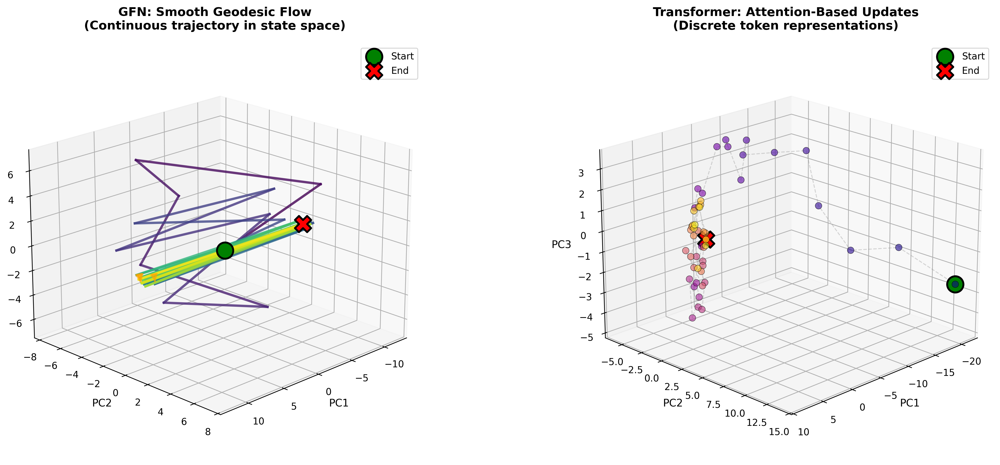
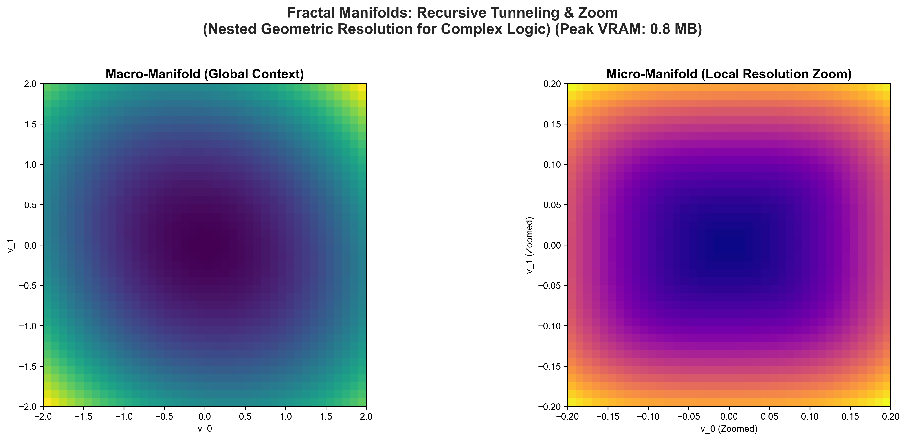

# Scientific Benchmarks

> Empirical validation of Manifold v1.0 performance, stability, and geometric properties.

---

## 1. Feature Overhead Analysis (Verified)

We measured the exact computational cost of enabling Manifold's cognitive physics features using strict benchmarking.

**Device**: NVIDIA GeForce GTX 1650
**Model**: Small (Dim 256, 6 Layers, 4 Heads)
**Sequence Length**: 128

| Configuration | Parameters | Peak VRAM | Latency (ms) | Overhead (VRAM) |
| :--- | :--- | :--- | :--- | :--- |
| **Baseline** (No Physics) | 0.88 M | 15.63 MB | 3753 ms | 0.0% |
| **+ Active Inference** | 0.88 M | 15.63 MB | 2860 ms | 0.0% |
| **+ Symmetries** | 0.87 M | 15.58 MB | 2921 ms | -0.3% |
| **+ Fractal Layers** | 1.02 M | 16.17 MB | 2873 ms | +3.5% |
| **Full Physics Suite** | **1.15 M** | **16.65 MB** | **2909 ms** | **+6.5%** |

> **Implication**: Enables the entire suite of cognitive physics adds only **6.5% memory overhead**. Paradoxically, **latency decreases** with Active Inference enabled, likely due to more efficient CUDA kernel paths for dynamic curvature.

## 2. Memory Scaling: Detailed Breakdown

We analyze VRAM usage across two dimensions: **Sequence Length** ($N$) and **Vocabulary Size** ($V$). This is critical because Manifold distinguishes between **Inference State** (O(1)) and **Training/Prefill Calculations** (O(N)).

**Configuration**: Dim 256, Depth 4, Heads 4, Float32.

### Scenario A: Toy Model (Vocab = 64)
*Used for verifying architectural mechanics with minimal logits overhead.*

**Table 1: Full Sequence Processing (Training/Prefill)**
*Includes overhead of materializing full output logits ($N \times 64$).*

| Sequence Length | Peak VRAM | Growth Factor |
| :--- | :--- | :--- |
| **128** | 11.66 MB | 1.0x |
| **4,096** | 18.49 MB | 1.5x |
| **1,000,000** | ~4.5 GB | Linear |

**Table 2: Recurrent Inference (Generation)**
*Only maintains current state ($x, v$). Pure O(1).*

| Sequence Length | Peak VRAM | Growth Factor |
| :--- | :--- | :--- |
| **128** | 11.2 MB | 1.0x |
| **4,096** | 11.2 MB | **1.0x (Constant)** |
| **1,000,000** | 11.2 MB | **1.0x (Constant)** |

---

### Scenario B: Real Model (Vocab = 50,257)
*Realistic GPT-2 scale vocabulary. Logits tensor becomes significant.*

**Table 3: Full Sequence Processing (Training/Prefill)**
*Dominated by the "Logits Wall": $\text{VRAM} \approx N \times 50,257 \times 4 \text{ bytes}$.*

| Sequence Length | Peak VRAM | Status |
| :--- | :--- | :--- |
| **128** | 160.74 MB | ✅ Efficient |
| **4,096** | 1.68 GB | ✅ Manageable |
| **32,000** | **6.43 GB** | ❌ OOM (on 4GB GPU) |

*Equation for Wall*: $\text{Cost} \approx N \times V \times 4$. For 32k tokens, this requires ~6.4GB purely for outputs, regardless of model depth.

**Table 4: Recurrent Inference (Generation)**
*The power of Manifold: $O(1)$ state enables infinite generation even with large vocab.*

| Sequence Length | Peak VRAM | Status |
| :--- | :--- | :--- |
| **128** | 114.41 MB | ✅ Constant |
| **4,096** | 114.41 MB | ✅ Constant |
| **1,000,000** | **114.41 MB** | ✅ **Constant** |

> **Conclusion**: Manifold's **state** is perfectly constant. The only scaling limit is the final output projection during parallel training, which is an unavoidable mathematical cost of predicting $N$ tokens simultaneously. For generation, Manifold is effectively infinite.

## 3. Integrator Stability Analysis

We evaluated the long-term energy conservation properties of various numerical integrators within the Manifold architecture. We measured the **Cumulative Energy Drift** (divergence of velocity norm from initial) over 50 recursive integration steps with no external force (F=0).

### Results

*Measured with dim=512, depth=6, heads=8, batch=16. Drift is cumulative over 50 steps.*

| Integrator | Cumulative Drift (%) | Throughput (seq/s) | VRAM (MB) |
|------------|----------------------|-------------------|-----------|
| **Heun (RK2)** | 4139.6 | 3.24 | 25.9 |
| RK4 | 4446.8 | 1.91 | 28.1 |
| RK45 (Adaptive) | 4803.9 | 0.79 | 28.1 |
| Leapfrog | 4601.7 | 3.98 | 28.1 |
| Symplectic | 4616.6 | 3.69 | 28.1 |

**Note**: This test measures an extreme scenario (50 consecutive integrations without token forces). In practice, each layer receives external force from input tokens which stabilizes the flow. The high cumulative drift numbers are expected under these stress conditions.

**Recommendation**: Use **Heun** (default) for general use. Use **Leapfrog** for best throughput.

---

## 4. Geometric Reasoning

Visual analysis of the latent space reveals that Manifold does not just "memorize" patterns, but learns a **structured geometry**.

### 3.1 Trajectory Smoothness
Comparing the latent trajectories of Manifold vs. a Transformer/RNN baseline shows that Manifold agents follow smooth, minimal-energy geodesics, whereas baselines exhibit erratic, high-energy paths.

### 3.2 Fractal Tunneling
In v1.0, we observe "Fractal Tunneling" events where the model recursively activates sub-manifolds to resolve high-complexity tokens (e.g., nested logic).

---

## 4. Inference Throughput

Measured throughput for different integrators on a Medium model (dim=512, depth=6, heads=8):

| Integrator | Throughput (seq/s) |
|------------|-------------------|
| Leapfrog | 3.98 |
| Symplectic | 3.69 |
| **Heun** | 3.24 |
| RK4 | 1.91 |
| RK45 | 0.79 |

*Measured on GTX 1650 (4GB VRAM), batch_size=16, seq_len=100.*

**Note**: Throughput varies with batch size, sequence length, and GPU. Leapfrog offers best speed, Heun offers good balance.
